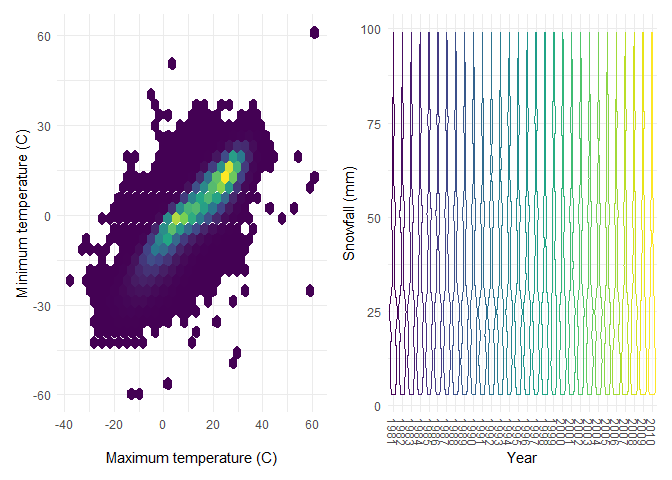

Homework 3
================

### Problem 3

#### Do some data cleaning. Create separate variables for year, month, and day. Ensure observations for temperature, precipitation, and snowfall are given in reasonable units.

``` r
data(na_noaa)
```

    ## Warning in data(na_noaa): data set 'na_noaa' not found

``` r
ny_noaa_df = ny_noaa %>%
          separate(date, into = c("year", "month", "day"), convert = TRUE) %>%
        mutate(
          year = factor(year), 
          month = as.integer(month), 
          day = as.integer(day),
          prcp = as.numeric(prcp),
          tmax = as.numeric(tmax), 
          tmin = as.numeric(tmin), 
          prcp = prcp/10, 
          tmax = tmax/10, 
          tmin = tmin/10
        ) 
```

#### For snowfall, what are the most commonly observed values? Why?

``` r
snow_df = ny_noaa_df %>%
          count(snow) %>%
          arrange(desc(n))

head(snow_df)
```

    ## # A tibble: 6 x 2
    ##    snow       n
    ##   <int>   <int>
    ## 1     0 2008508
    ## 2    NA  381221
    ## 3    25   31022
    ## 4    13   23095
    ## 5    51   18274
    ## 6    76   10173

It seems like the most commonly observed values was 0 when we count the
observations of the snow variable and arrange it in a descending order.

#### Make a two-panel plot showing the average max temperature in January and in July in each station across years. Is there any observable / interpretable structure? Any outliers?

``` r
ny_noaa_df %>%
  filter(month %in% c("1", "7")) %>%
  group_by(id, year, month) %>%
  summarize(
    avg_tmax = mean(tmax, na.rm = TRUE)) %>%
  ggplot(aes(x = year, y = avg_tmax, group = id, color = month))+
  geom_point(alpha = .5, size = .5) + 
  geom_path() + 
  facet_grid(.~month) +
  theme(axis.text.x = element_text(angle = 270, vjust = .5, hjust =1))
```

    ## `summarise()` regrouping output by 'id', 'year' (override with `.groups` argument)

    ## Warning: Removed 5970 rows containing missing values (geom_point).

    ## Warning: Removed 5931 row(s) containing missing values (geom_path).

<!-- -->

It seems like the average maximum temperature is generally much higher
in July than in January over all the weather stations, which makes sense
as they are in different seasons. There seems to be outliers in January
of 1982 and July of 1988.

#### Make a two-panel plot showing (i) tmax vs tmin for the full dataset (note that a scatterplot may not be the best option). (ii) Make a plot showing the distribution of snowfall values greater than 0 and less than 100 separately by year.;

``` r
tmax_tmin = ny_noaa_df %>%
            ggplot(aes(x = as.numeric(tmax), y = as.numeric(tmin))) +
            geom_hex() + 
            labs(
              x = "Maximum temperature (C)", 
              y = "Minimum temperature (C)"
            )+ 
            theme(legend.position = "none")

snow_dist = ny_noaa_df %>%
            filter(snow > 0 & snow <100) %>%
            ggplot(aes(x = year, y = snow, color = year)) + 
            geom_violin(alpha = .5) + 
            theme(axis.text.x = element_text(angle = 270, vjust = .5, hjust = 1)) + 
            theme(legend.position = "none") + 
            labs(
              x = "Year", 
              y = "Snowfall (mm)"
            )

tmax_tmin + snow_dist 
```

    ## Warning: Removed 1136276 rows containing non-finite values (stat_binhex).

<!-- -->
