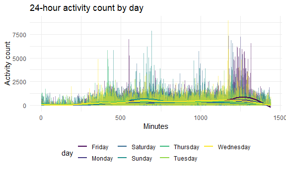

Homework 3
================
October 10, 2020

### Problem 1

#### Write a short description of the dataset, noting the size and structure of the data, describing some key variables, and giving illstrative examples of observations.

``` r
data("instacart")

head(instacart)
```

    ## # A tibble: 6 x 15
    ##   order_id product_id add_to_cart_ord~ reordered user_id eval_set order_number
    ##      <int>      <int>            <int>     <int>   <int> <chr>           <int>
    ## 1        1      49302                1         1  112108 train               4
    ## 2        1      11109                2         1  112108 train               4
    ## 3        1      10246                3         0  112108 train               4
    ## 4        1      49683                4         0  112108 train               4
    ## 5        1      43633                5         1  112108 train               4
    ## 6        1      13176                6         0  112108 train               4
    ## # ... with 8 more variables: order_dow <int>, order_hour_of_day <int>,
    ## #   days_since_prior_order <int>, product_name <chr>, aisle_id <int>,
    ## #   department_id <int>, aisle <chr>, department <chr>

``` r
summary(instacart)
```

    ##     order_id         product_id    add_to_cart_order   reordered     
    ##  Min.   :      1   Min.   :    1   Min.   : 1.000    Min.   :0.0000  
    ##  1st Qu.: 843370   1st Qu.:13380   1st Qu.: 3.000    1st Qu.:0.0000  
    ##  Median :1701880   Median :25298   Median : 7.000    Median :1.0000  
    ##  Mean   :1706298   Mean   :25556   Mean   : 8.758    Mean   :0.5986  
    ##  3rd Qu.:2568023   3rd Qu.:37940   3rd Qu.:12.000    3rd Qu.:1.0000  
    ##  Max.   :3421070   Max.   :49688   Max.   :80.000    Max.   :1.0000  
    ##     user_id         eval_set          order_number      order_dow    
    ##  Min.   :     1   Length:1384617     Min.   :  4.00   Min.   :0.000  
    ##  1st Qu.: 51732   Class :character   1st Qu.:  6.00   1st Qu.:1.000  
    ##  Median :102933   Mode  :character   Median : 11.00   Median :3.000  
    ##  Mean   :103113                      Mean   : 17.09   Mean   :2.701  
    ##  3rd Qu.:154959                      3rd Qu.: 21.00   3rd Qu.:5.000  
    ##  Max.   :206209                      Max.   :100.00   Max.   :6.000  
    ##  order_hour_of_day days_since_prior_order product_name          aisle_id    
    ##  Min.   : 0.00     Min.   : 0.00          Length:1384617     Min.   :  1.0  
    ##  1st Qu.:10.00     1st Qu.: 7.00          Class :character   1st Qu.: 31.0  
    ##  Median :14.00     Median :15.00          Mode  :character   Median : 83.0  
    ##  Mean   :13.58     Mean   :17.07                             Mean   : 71.3  
    ##  3rd Qu.:17.00     3rd Qu.:30.00                             3rd Qu.:107.0  
    ##  Max.   :23.00     Max.   :30.00                             Max.   :134.0  
    ##  department_id      aisle            department       
    ##  Min.   : 1.00   Length:1384617     Length:1384617    
    ##  1st Qu.: 4.00   Class :character   Class :character  
    ##  Median : 8.00   Mode  :character   Mode  :character  
    ##  Mean   : 9.84                                        
    ##  3rd Qu.:16.00                                        
    ##  Max.   :21.00

This instacart dataset contains 1384617 rows and 15 columns. Each
observation provides order-related information regarding the each
product per order by individual users. That is, observations are the
level of items in orders by users. There are user/order variables – user
ID, order ID, order day, and order hour. There are also item variables –
name, aisle, department, and some numeric codes. For example, user with
a user ID of 112108 placed order with an order ID of 1 that included one
Bulgarian Yogurt (product ID of 49302), which was a reordered item, from
the dariy eggs department (department ID of 16) and yogurt aisle (aisle
ID of 120).

#### How many aisles are there, and which aisles are the most items ordered from?

``` r
instacart %>%
  count(aisle) %>%
  arrange(desc(n))
```

    ## # A tibble: 134 x 2
    ##    aisle                              n
    ##    <chr>                          <int>
    ##  1 fresh vegetables              150609
    ##  2 fresh fruits                  150473
    ##  3 packaged vegetables fruits     78493
    ##  4 yogurt                         55240
    ##  5 packaged cheese                41699
    ##  6 water seltzer sparkling water  36617
    ##  7 milk                           32644
    ##  8 chips pretzels                 31269
    ##  9 soy lactosefree                26240
    ## 10 bread                          23635
    ## # ... with 124 more rows

There are 134 aisles in the dataset and it seems like the top 3 aisles
where the most items are ordered from are “fresh vegetables”, “fresh
fruits”, and “packaged vegetable fruits”.

#### Make a plot that shows the number of items ordered in each aisle, limiting this to aisles with more than 10000 items ordered. Arrange aisles sensibly, and organize your plot so others can read it.

``` r
instacart %>%
  count(aisle) %>%
  filter(n > 10000) %>%
  mutate(
    aisle = factor(aisle),
    aisle = fct_reorder(aisle, n)
  ) %>%
  ggplot(aes(x = aisle, y = n)) + 
  geom_point() + 
  theme(axis.text.x = element_text(angle = 90, vjust = 0.5, hjust = 1)) 
```


#### Make a table showing the three most popular items in each of the aisles “baking ingredients”, “dog food care”, and “packaged vegetables fruits”. Include the number of times each item is ordered in your table.

``` r
instacart %>%
  filter(aisle %in% c("baking ingredients", "dog food care", "packaged vegetables fruits")) %>%
  group_by(aisle) %>%
  count(product_name) %>%
  mutate(rank = min_rank(desc(n))) %>%
  filter(rank < 4) %>%
  arrange(aisle, rank) %>%
  knitr::kable()
```

| aisle                      | product\_name                                 |    n | rank |
| :------------------------- | :-------------------------------------------- | ---: | ---: |
| baking ingredients         | Light Brown Sugar                             |  499 |    1 |
| baking ingredients         | Pure Baking Soda                              |  387 |    2 |
| baking ingredients         | Cane Sugar                                    |  336 |    3 |
| dog food care              | Snack Sticks Chicken & Rice Recipe Dog Treats |   30 |    1 |
| dog food care              | Organix Chicken & Brown Rice Recipe           |   28 |    2 |
| dog food care              | Small Dog Biscuits                            |   26 |    3 |
| packaged vegetables fruits | Organic Baby Spinach                          | 9784 |    1 |
| packaged vegetables fruits | Organic Raspberries                           | 5546 |    2 |
| packaged vegetables fruits | Organic Blueberries                           | 4966 |    3 |

#### Make a table showing the mean hour of the day at which Pink Lady Apples and Coffee Ice Cream are ordered on each day of the week; format this table for human readers.

``` r
instacart %>%
  filter(product_name %in% c("Pink Lady Apples", "Coffee Ice Cream")) %>%
  group_by(product_name, order_dow) %>%
  summarize(mean_hour = mean(order_hour_of_day)) %>%
  pivot_wider(
    names_from = order_dow, 
    values_from = mean_hour
  )
```

    ## `summarise()` regrouping output by 'product_name' (override with `.groups` argument)

    ## # A tibble: 2 x 8
    ## # Groups:   product_name [2]
    ##   product_name       `0`   `1`   `2`   `3`   `4`   `5`   `6`
    ##   <chr>            <dbl> <dbl> <dbl> <dbl> <dbl> <dbl> <dbl>
    ## 1 Coffee Ice Cream  13.8  14.3  15.4  15.3  15.2  12.3  13.8
    ## 2 Pink Lady Apples  13.4  11.4  11.7  14.2  11.6  12.8  11.9

### Problem 2

#### Your final dataset should include all originally observed variables and values; have useful variable names; include a weekday vs weekend variable; and encode data with reasonable variable classes. Describe the resulting dataset (e.g. what variables exist, how many observations, etc).

``` r
accel_df = 
  read_csv("./Data/accel_data.csv") %>%
  janitor::clean_names() %>%
  pivot_longer(
    activity_1:activity_1440, 
    names_to = "minutes", 
    names_prefix = "activity_", 
    values_to = "activity_count"
  ) %>% 
  mutate(minutes = as.numeric(minutes), 
         day_num = recode(day, "Monday" = "1", 
                             "Tuesday" = "2", 
                             "Wednesday" = "3", 
                             "Thursday" = "4", 
                             "Friday" = "5", 
                             "Saturday" = "6", 
                             "Sunday" = "7")
  ) %>%
  mutate(
    weekday_vs_weekend = case_when(
      day_num <=5 ~ "Weekday", 
      day_num > 5 ~ "Weekend", 
      TRUE ~ ""
    )
  ) %>%
  
  select(-day_num)
```

    ## 
    ## -- Column specification ---------------------------------------------------------------
    ## cols(
    ##   .default = col_double(),
    ##   day = col_character()
    ## )
    ## i Use `spec()` for the full column specifications.

``` r
head(accel_df)
```

    ## # A tibble: 6 x 6
    ##    week day_id day    minutes activity_count weekday_vs_weekend
    ##   <dbl>  <dbl> <chr>    <dbl>          <dbl> <chr>             
    ## 1     1      1 Friday       1           88.4 Weekday           
    ## 2     1      1 Friday       2           82.2 Weekday           
    ## 3     1      1 Friday       3           64.4 Weekday           
    ## 4     1      1 Friday       4           70.0 Weekday           
    ## 5     1      1 Friday       5           75.0 Weekday           
    ## 6     1      1 Friday       6           66.3 Weekday

This dataset contains information regarding five weeks of accelerometer
data collected on a 63 year-old male with BMI 25, who was admitted to
the Advanced Cardiac Care Center of Columbia University Medical Center
and diagnosed with congestive heart failure (CHF). The accelarator
dataset contains information regarding the following variables:
activity\_count, day, day\_id, minutes, week, weekday\_vs\_weekend. The
key variable, activity\_count, gives activity information for each
minute of a 24-hour day starting at midnight. There are a total of 50400
rows and 6 columns in the final dataset.

#### Traditional analyses of accelerometer data focus on the total activity over the day. Using your tidied dataset, aggregate accross minutes to create a total activity variable for each day, and create a table showing these totals. Are any trends apparent?

``` r
accel_df %>%
  mutate(day = as.factor(day)) %>%
  group_by(week, day) %>%
  summarize(
    total_activity = sum(activity_count)
  ) %>%
  pivot_wider(
    names_from = day, 
    values_from = total_activity
  ) 
```

    ## `summarise()` regrouping output by 'week' (override with `.groups` argument)

    ## # A tibble: 5 x 8
    ## # Groups:   week [5]
    ##    week  Friday  Monday Saturday Sunday Thursday Tuesday Wednesday
    ##   <dbl>   <dbl>   <dbl>    <dbl>  <dbl>    <dbl>   <dbl>     <dbl>
    ## 1     1 480543.  78828.   376254 631105  355924. 307094.   340115.
    ## 2     2 568839  295431    607175 422018  474048  423245    440962 
    ## 3     3 467420  685910    382928 467052  371230  381507    468869 
    ## 4     4 154049  409450      1440 260617  340291  319568    434460 
    ## 5     5 620860  389080      1440 138421  549658  367824    445366

The patient seems to be more active on Fridays and the less active on
Saturdays. We could also argue that overall activity increases over time
as the weeks go by but it is difficult to make a definitive conclusion
on apparent trends without further analysis.

#### Make a single-panel plot that shows the 24-hour activity time courses for each day and use color to indicate day of the week. Describe in words any patterns or conclusions you can make based on this graph.

``` r
accel_df %>%
ggplot(aes(x = minutes, y = activity_count, color = day)) +
  geom_line(alpha = .5) +
  geom_smooth(aes(group = day), se = FALSE) + 
  labs(title = "24-hour activity count by day",
    x = "Minutes", 
    y = "Activity count"
  )
```

    ## `geom_smooth()` using method = 'gam' and formula 'y ~ s(x, bs = "cs")'



Based on the graph, in general, the patient seems to be more active on
the weekends as the most noticeably high activity counts were observed
on Friday, Saturday, and Sunday. Overall, the patient seems to be more
active in the morning before noon and around 7pm/8pm at night. More
specifically, it seems like the patient is more active during the day
(mid-mornings) on Sundays and more active in the evening on Fridays.
Therefore, we can conclude that the time at which the patient is more
active seems to depend on which day of the week it is and the time of
the day.

### Problem 3

#### Do some data cleaning. Create separate variables for year, month, and day. Ensure observations for temperature, precipitation, and snowfall are given in reasonable units.

``` r
data(na_noaa)
```

    ## Warning in data(na_noaa): data set 'na_noaa' not found

``` r
ny_noaa_df = ny_noaa %>%
          separate(date, into = c("year", "month", "day"), convert = TRUE) %>%
        mutate(
          year = factor(year), 
          month = as.integer(month), 
          day = as.integer(day),
          prcp = as.numeric(prcp),
          tmax = as.numeric(tmax), 
          tmin = as.numeric(tmin), 
          prcp = prcp/10, 
          tmax = tmax/10, 
          tmin = tmin/10
        ) 

head(ny_noaa_df)
```

    ## # A tibble: 6 x 9
    ##   id          year  month   day  prcp  snow  snwd  tmax  tmin
    ##   <chr>       <fct> <int> <int> <dbl> <int> <int> <dbl> <dbl>
    ## 1 US1NYAB0001 2007     11     1    NA    NA    NA    NA    NA
    ## 2 US1NYAB0001 2007     11     2    NA    NA    NA    NA    NA
    ## 3 US1NYAB0001 2007     11     3    NA    NA    NA    NA    NA
    ## 4 US1NYAB0001 2007     11     4    NA    NA    NA    NA    NA
    ## 5 US1NYAB0001 2007     11     5    NA    NA    NA    NA    NA
    ## 6 US1NYAB0001 2007     11     6    NA    NA    NA    NA    NA

The NY NOAA dataset contains information from the National Oceanic and
Atmospheric Association. It contains the following 5 variables for
weather stations in New York state from January 1, 1981 to December 31,
2010: day, id, month, prcp, snow, snwd, tmax, tmin, year. It contains a
total of 2595176 rows and 9 columns.

#### For snowfall, what are the most commonly observed values? Why?

``` r
snow_df = ny_noaa_df %>%
          count(snow) %>%
          arrange(desc(n))

head(snow_df)
```

    ## # A tibble: 6 x 2
    ##    snow       n
    ##   <int>   <int>
    ## 1     0 2008508
    ## 2    NA  381221
    ## 3    25   31022
    ## 4    13   23095
    ## 5    51   18274
    ## 6    76   10173

It seems like the most commonly observed values was 0 when we count the
observations of the snow variable and arrange it in a descending order.

#### Make a two-panel plot showing the average max temperature in January and in July in each station across years. Is there any observable / interpretable structure? Any outliers?

``` r
ny_noaa_df %>%
  filter(month %in% c("1", "7")) %>%
  group_by(id, year, month) %>%
  summarize(
    avg_tmax = mean(tmax, na.rm = TRUE)) %>%
  ggplot(aes(x = year, y = avg_tmax, group = id, color = month))+
  geom_point(alpha = .5, size = .5) + 
  geom_path() + 
  facet_grid(.~month) +
  theme(axis.text.x = element_text(angle = 270, vjust = .5, hjust =1))+ 
  labs(title = "Average max temperature in January and July across years for each station", 
    x = "Year", 
    y = "Average Max Temp (C)"
  )
```

    ## `summarise()` regrouping output by 'id', 'year' (override with `.groups` argument)

    ## Warning: Removed 5970 rows containing missing values (geom_point).

    ## Warning: Removed 5931 row(s) containing missing values (geom_path).


It seems like the average maximum temperature is generally much higher
and there is a distinct difference in the average maximum temperature in
July versus January over all the weather stations from 1981 to 2010,
which makes sense as they are in different seasons. In addition, it
seems like there is more variability in the temperature values in
January compared to July. There seems to be outliers in January of 1982
and July of 1988. We could also say that there may be a slight
increasing trend in January, which could be due to global warming.

#### Make a two-panel plot showing (i) tmax vs tmin for the full dataset (note that a scatterplot may not be the best option). (ii) Make a plot showing the distribution of snowfall values greater than 0 and less than 100 separately by year.;

``` r
tmax_tmin = ny_noaa_df %>%
            ggplot(aes(x = as.numeric(tmax), y = as.numeric(tmin))) +
            geom_hex() + 
            labs(
              x = "Maximum temperature (C)", 
              y = "Minimum temperature (C)"
            )+ 
            theme(legend.position = "none")

snow_dist = ny_noaa_df %>%
            filter(snow > 0 & snow <100) %>%
            ggplot(aes(x = year, y = snow, color = year)) + 
            geom_violin(alpha = .5) + 
            theme(axis.text.x = element_text(angle = 270, vjust = .5, hjust = 1)) + 
            theme(legend.position = "none") + 
            labs(
              x = "Year", 
              y = "Snowfall (mm)"
            )

tmax_tmin + snow_dist 
```

    ## Warning: Removed 1136276 rows containing non-finite values (stat_binhex).


Based on the hex plot, we can see that the majority of the data cluster
in the center despite some level of variability. There are instances
where the tmax value is less than the tmin value, which indicates that
there might have been issues with data quality and measurement.

Based on the geom\_violin plot, it seems like most stations see between
0 and 35mm of snowfall in a year with some variability.
